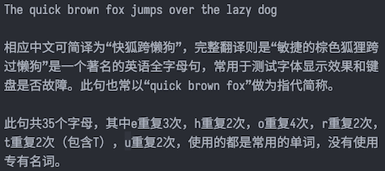
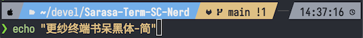
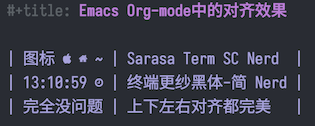

# `Sarasa Term SC Nerd` 字体

## 关于

`Sarasa Term SC Nerd` 字体是以 [Sarasa Term
SC](https://github.com/be5invis/Sarasa-Gothic)字体为基础，修改了[Nerd
fonts](https://github.com/ryanoasis/nerd-fonts)字体补丁程序，然后用该程序将`Nerd
fonts`合并入`Sarasa Term SC`, 再经过一些后处理，而最后形成的字体。该字体特别适合
**简体中文**用户在**终端**或者**代码编辑器**中使用。

上游版本：

- Sarasa Term SC：1.0.22
- Nerd Font: 3.2.1
- Font Patcher: 4.14.5

## 字体效果

- 文字效果：以 Regular 样式为例

  
- 图标效果：Powerline 图标

  
- 对齐效果：终端里 emacs/org-mode 中的表格对齐

  

## 特性

- `Sarasa Term SC` 是极少数做到中文和英文 2:1 严格对齐的字体，特别适合用来写代
  码, 以及中英文混合的字符式表格的对齐等。
- `Nerd fonts` 提供了很多图标字体，特别适合各种 Zsh/Bash/Vim/NeoVim/Emacs 主题，
  例如 zsh 的 [`p10k`](https://github.com/romkatv/powerlevel10k),
  [`Powerline`](https://github.com/powerline/powerline) 等等。
- 一些符号进行了纵向拉伸，不会出现`Powerline`条带中高低不一，无法上下对齐的情况。
- 原始`Sarasa Term SC`字体和`Sarasa Term SC Nerd`字体可以共存，不会产生冲突。
- 加入了`hdmx`表，解决了 windows 系统下的一些情况下无法严格对齐的问题。
- 修正了`OS/2`表中的`panose`和`post`表中的`isFixedPitch`，使得字体被系统认出是等
  宽字体。

## 安装

- MacOS 用户可以直接通过 cask 安装：
  ```sh
  brew tap laishulu/homebrew
  brew install font-sarasa-nerd
  ```
- 手工下载安装：
  - 前往 [release](https://github.com/laishulu/Sarasa-Term-SC-Nerd/releases) 下载
  - 每个`ttf`文件是一个字体样式，`ttc`文件是所有样式的合集。

## 使用

在你的主题配置文件中，使用 `Sarasa Term SC Nerd`。

## 自己生成字体

```sh
# Install deps
sudo apt update && sudo apt install -y fontforge python3-fontforge python3-fonttools p7zip jq

# Download Sarasa Gothic
wget -q $(curl 'https://api.github.com/repos/be5invis/Sarasa-Gothic/releases' | jq -r '.[0].assets | map(.browser_download_url) | map(select(test("SarasaTermSC-TTF-[0-9.]+\\.7z"))) | .[0]')
7zr x Sarasa*.7z
mkdir sarasa
mv Sarasa*.ttf sarasa

# Download Font Patcher
wget -q https://github.com/ryanoasis/nerd-fonts/raw/refs/heads/master/FontPatcher.zip
unzip FontPatcher.zip

# Copy Scripts
cp scripts/font-patcher font-patcher && cp scripts/otf2otc.py otf2otc.py

# name: Build Nerd
bash -xeu scripts/build
```

在 macOS 中，注意需要使用 fontforge 自带的 python

```sh
brew install fontforge
pipenv --site-packages --python=/Applications/FontForge.app/Contents/Frameworks/Python.framework/Versions/Current/bin/python3

```
